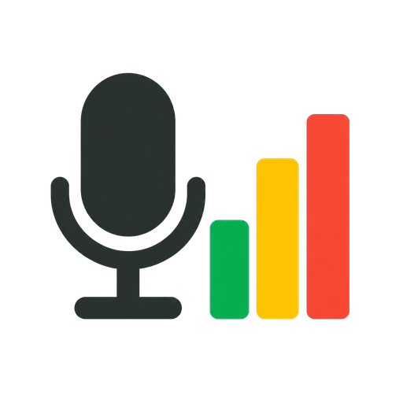
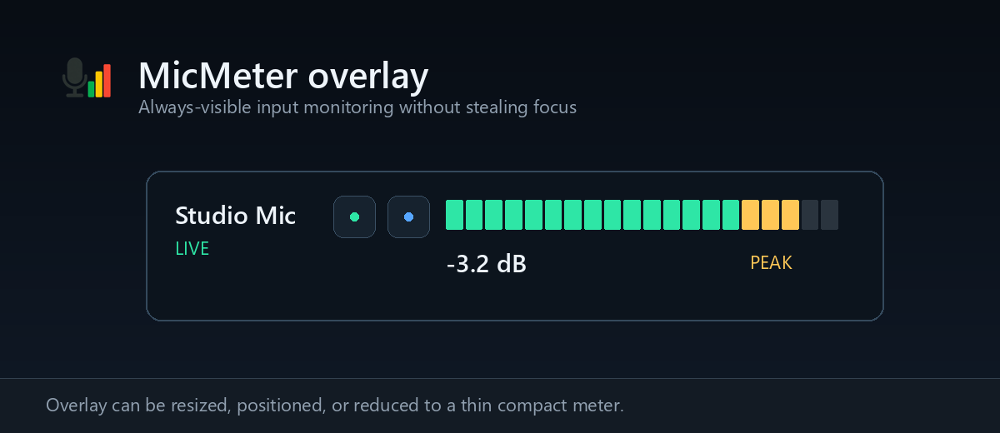
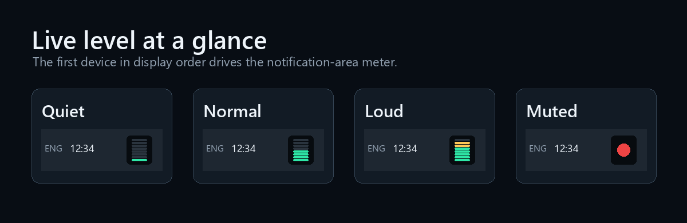

<p align="center">
  
</p>

<h1 align="center">MicMeter</h1>

<p align="center">
  A lightweight, always-visible microphone level meter for Windows.<br>
  Monitor multiple inputs, mute instantly, and keep the first device visible in the notification area.
</p>

<p align="center">
  
  
  
  <a href="https://github.com/arasan95/MicMeter/actions/workflows/build.yml"></a>
</p>



## Why MicMeter?

MicMeter keeps microphone activity visible without opening an audio settings window. It continuously monitors selected WASAPI capture devices in shared mode, making it useful for physical microphones, audio interfaces, and virtual loopback devices used with Discord, streaming, or recording software.

The first device in your configured display order is also rendered as a tiny live meter in the Windows notification area:



## Features

- Multiple input devices with configurable display order
- Horizontal, vertical, and automatic compact layouts
- Configurable low, mid, and high meter colors and dB thresholds
- dBFS value, peak hold, and clipping warning
- Per-device mute and low-latency listening
- Configurable global mute hotkey
- Distinct CC0 notification sounds for mute and unmute
- Persistent, draggable on-screen warning while a microphone is muted
- Live notification-area meter for the first device
- Single-click tray mute and double-click overlay visibility
- Resizable, draggable, always-on-top overlay with saved position and size
- Midnight Glass and square Flat Black themes
- Japanese and English settings UI
- Automatic device reconnection

## Requirements

- Windows 10 or Windows 11
- [.NET 10 SDK](https://dotnet.microsoft.com/download/dotnet/10.0) to build from source
- Headphones are strongly recommended when using microphone listening

## Build and run

```powershell
git clone https://github.com/arasan95/MicMeter.git
cd MicMeter
dotnet restore
dotnet run --project src/MicMeter/MicMeter.csproj
```

To create a Release build:

```powershell
dotnet publish src/MicMeter/MicMeter.csproj `
  -c Release `
  -r win-x64 `
  --self-contained false
```

The published files are written under `src/MicMeter/bin/Release/net10.0-windows/win-x64/publish/`.

## Usage

- Drag the overlay to position it.
- Drag its lower-right corner to resize it.
- Right-click the overlay to open Settings.
- Click a microphone control to mute that device.
- Click the listening control to monitor that input through the default output device.
- Left-click the notification-area meter to mute the first configured device.
- Double-click the notification-area meter to show or hide the overlay.
- Right-click the notification-area meter for the application menu.
- Use **Position mute overlay** in Settings, then drag the preview to save its location.

In Settings, use **Language / 言語** to switch between English and Japanese. Settings are saved to `%LocalAppData%\MicMeter\settings.json`.

## Notification-area behavior

The live tray meter follows the first selected device in display order and refreshes at 10 FPS. Its colors and thresholds match the overlay. Muted devices appear as a red dot, disconnected devices as a gray cross, and clipping is indicated by a red border.

Windows may initially place the icon in the notification-area overflow menu. Pin MicMeter through Windows taskbar settings if you want it permanently visible.

## Privacy and audio behavior

MicMeter reads live sample peaks only. It does not save, transmit, or record microphone audio. Selected capture devices remain open in WASAPI shared mode so virtual loopback meters continue working when another application closes its microphone test.

Audio is played only while the listening feature is enabled. Use headphones to prevent feedback.
The short mute and unmute UI sounds can be disabled independently from the on-screen mute overlay.

## Development

```powershell
dotnet test tests/MicMeter.Tests/MicMeter.Tests.csproj -c Release
```

Built with .NET 10, WPF, Windows Forms `NotifyIcon`, Core Audio, and [NAudio](https://github.com/naudio/NAudio). See [THIRD-PARTY-NOTICES.md](THIRD-PARTY-NOTICES.md) for dependency attribution.

---

## 日本語

MicMeterは、Windowsのマイク入力レベルをオーバーレイと通知領域に常時表示する軽量ツールです。物理マイク、オーディオインターフェース、仮想ループバックを複数選択して監視できます。

主な機能：

- 複数入力デバイスの同時表示と並べ替え
- 横型・縦型・自動コンパクト表示
- 緑・黄・赤の色と切替dB位置の設定
- dBFS数値、ピークホールド、クリッピング警告
- 個別ミュート、リスニング、変更可能なグローバルホットキー
- ミュート・解除時の短い通知音
- ミュート中に常時表示され、ドラッグで配置できる警告オーバーレイ
- 表示順1番目のデバイスを通知領域の小型メーターに表示
- オーバーレイの移動、リサイズ、位置・大きさの保存
- 日本語・英語の設定画面

実行方法：

```powershell
dotnet run --project src/MicMeter/MicMeter.csproj
```

設定画面の「言語」から日本語と英語を切り替えられます。リスニング機能を使う場合は、ハウリング防止のためヘッドホンを使用してください。
