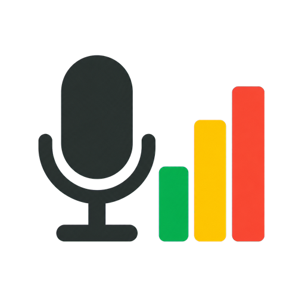
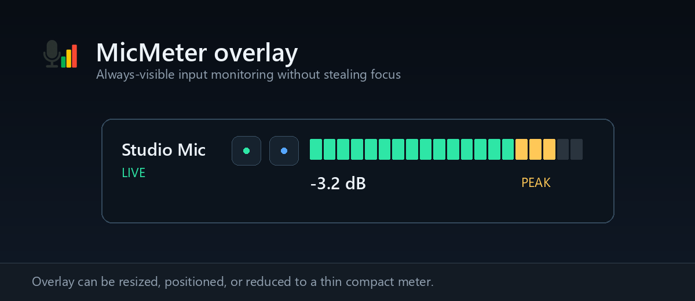
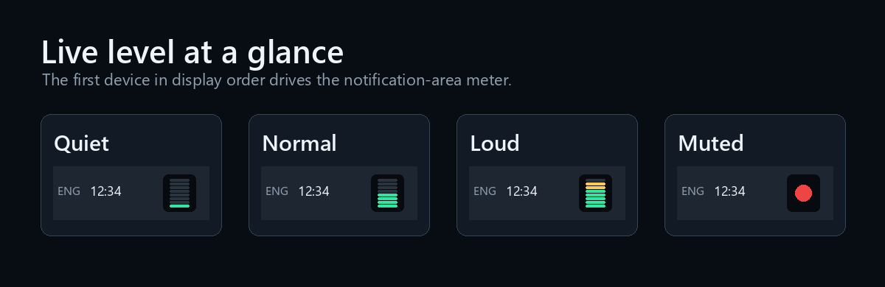

<p align="center">
  
</p>

<h1 align="center">MicMeter</h1>

<p align="center">
  A lightweight, always-visible microphone level meter for Windows and macOS.<br>
  Monitor multiple inputs, mute instantly, and keep the first device visible in the menu bar or notification area.
</p>

<p align="center">
  
  
  
  
  <a href="https://github.com/arasan95/MicMeter/actions/workflows/build.yml"></a>
</p>



## Why MicMeter?

MicMeter keeps microphone activity visible without opening an audio settings window. It continuously monitors selected capture devices, making it useful for physical microphones, audio interfaces, and virtual loopback devices used with Discord, streaming, or recording software.

The first device in your configured display order is also rendered as a tiny live meter in the macOS menu bar or the Windows notification area:



## Features

- Multiple input devices with configurable display order
- Horizontal, vertical, and automatic compact layouts
- Configurable low, mid, and high meter colors and dB thresholds
- dBFS value, peak hold, and clipping warning
- Per-device mute and low-latency listening
- Configurable global mute hotkey
- Distinct CC0 notification sounds for mute and unmute
- Persistent, draggable on-screen warning while a microphone is muted
- Live menu-bar meter (macOS) and notification-area meter (Windows) for the first device
- Single-click tray mute and double-click overlay visibility
- Resizable, draggable, always-on-top overlay with saved position and size
- Midnight Glass and square Flat Black themes
- Japanese and English settings UI
- Automatic device reconnection

## Requirements

- Windows 10 or Windows 11, or macOS 12 or later
- [.NET 10 SDK](https://dotnet.microsoft.com/download/dotnet/10.0) to build from source
- Headphones are strongly recommended when using microphone listening

## Build and run

```bash
git clone https://github.com/arasan95/MicMeter.git
cd MicMeter
dotnet restore
dotnet run --project src/MicMeter/MicMeter.csproj
```

To create a Windows Release build:

```powershell
dotnet publish src/MicMeter/MicMeter.csproj `
  -c Release `
  -r win-x64 `
  -f net10.0-windows `
  --self-contained false
```

The published files are written under `src/MicMeter/bin/Release/net10.0-windows/win-x64/publish/`.

To create a macOS Release build and `.app` bundle:

```bash
dotnet publish src/MicMeter/MicMeter.csproj \
  -c Release \
  -r osx-arm64 \
  -f net10.0 \
  --self-contained false \
  -o artifacts/MicMeter-osx-arm64
bash scripts/package-macos.sh artifacts/MicMeter-osx-arm64 artifacts
```

## Usage

- Drag the overlay to position it.
- Drag its lower-right corner to resize it.
- Right-click the overlay to open Settings.
- Click a microphone control to mute that device.
- Click the listening control to monitor that input through the default output device.
- Click the menu-bar or notification-area meter to mute the first configured device.
- Double-click the menu-bar or notification-area meter to show or hide the overlay.
- On Windows, right-click the notification-area meter for the application menu.
- Use **Position mute overlay** in Settings, then drag the preview to save its location.

In Settings, use **Language / 言語** to switch between English and Japanese. Settings are saved to `%LocalAppData%\MicMeter\settings.json` on Windows and `~/Library/Application Support/MicMeter/settings.json` on macOS.

## macOS: Plugin mode (driver-free muting)

macOS CoreAudio exposes no API to mute an individual audio device, so MicMeter
cannot silence an interface's input the way the Windows driver does. On macOS,
MicMeter instead pairs with a small LV2 plugin running inside your audio host:

1. In Settings, set **Routing mode** to **Plugin**.
2. In your host (Carla, Element, Ardour, Reaper, ...) insert the **MicMeter
   Mute** plugin on the microphone channel you want to meter or mute. The
   plugin is copied to `~/Library/Audio/Plug-Ins/LV2` automatically the first
   time the app runs, so no admin rights are needed.
3. The overlay now shows the live level of that channel, the **mute** control
   silences the channel (what other apps hear), and the **listen** control
   plays the channel back through the system output (or the device selected
   under **Listening output** in Settings).

The plugin and the app communicate through a small shared-memory block, so
Plugin mode works without any driver. Restart your host after installing or
updating MicMeter so it reloads the plugin bundle.

## Install and uninstall (macOS)

After building (see above), install everything in one step:

```bash
bash scripts/install-macos.sh
```

This installs the app to `/Applications`, the LV2 plugin to
`~/Library/Audio/Plug-Ins/LV2`, and — with an admin-password prompt — the
MicMeter Loopback HAL driver to `/Library/Audio/Plug-Ins/HAL` (only needed for
Loopback mode). 

To remove MicMeter completely:

```bash
bash scripts/uninstall-macos.sh
```

This deletes the app, the plugin, the driver, your settings, the debug log and
the shared-memory objects (the driver removal asks for admin rights).

## Menu bar and notification area

The live tray meter follows the first selected device in display order and refreshes at 10 FPS. Its colors and thresholds match the overlay. Muted devices appear as a red dot, disconnected devices as a gray cross, and clipping is indicated by a red border. On macOS it renders in the menu bar as an `NSStatusItem`; on Windows it renders in the notification area.

Windows may initially place the icon in the notification-area overflow menu. Pin MicMeter through Windows taskbar settings if you want it permanently visible.

## Privacy and audio behavior

MicMeter reads live sample peaks only. It does not save, transmit, or record microphone audio. On Windows, selected capture devices remain open in WASAPI shared mode so virtual loopback meters continue working when another application closes its microphone test. On macOS, MicMeter captures input devices through CoreAudio in Loopback mode and reads levels from the built-in LV2 plugin in Plugin mode.

Audio is played only while the listening feature is enabled. Use headphones to prevent feedback.
The short mute and unmute UI sounds can be disabled independently from the on-screen mute overlay.

## Development

```bash
dotnet test tests/MicMeter.Core.Tests/MicMeter.Core.Tests.csproj -c Release
```

Built with .NET 10, [Avalonia](https://avaloniaui.net/), Core Audio, CoreAudio on macOS, and [NAudio](https://github.com/naudio/NAudio) on Windows. See [THIRD-PARTY-NOTICES.md](THIRD-PARTY-NOTICES.md) for dependency attribution.

---

## 日本語

MicMeterは、Windows/macOSのマイク入力レベルをオーバーレイとメニューバー/通知領域に常時表示する軽量ツールです。物理マイク、オーディオインターフェース、仮想ループバックを複数選択して監視できます。

主な機能：

- 複数入力デバイスの同時表示と並べ替え
- 横型・縦型・自動コンパクト表示
- 緑・黄・赤の色と切替dB位置の設定
- dBFS数値、ピークホールド、クリッピング警告
- 個別ミュート、リスニング、変更可能なグローバルホットキー
- ミュート・解除時の短い通知音
- ミュート中に常時表示され、ドラッグで配置できる警告オーバーレイ
- 表示順1番目のデバイスをメニューバー（macOS）/通知領域（Windows）の小型メーターに表示
- オーバーレイの移動、リサイズ、位置・大きさの保存
- 日本語・英語の設定画面

実行方法：

```bash
dotnet run --project src/MicMeter/MicMeter.csproj
```

設定画面の「言語」から日本語と英語を切り替えられます。リスニング機能を使う場合は、ハウリング防止のためヘッドホンを使用してください。

### macOS: プラグインモード（ドライバ不要のミュート）

macOS の CoreAudio には個別のオーディオデバイスを直接ミュートする API がなく、Windows のドライバ方式のように「特定の入力デバイスを黙らせる」ことはできません。そのため macOS では、DAW などのホストに入れる連携用 LV2 プラグインを使います。

1. 設定の「ルーティングモード」を **プラグイン** にします。
2. ホスト（Carla、Element、Ardour、Reaper など）の「マイク」チャンネルに **MicMeter Mute** プラグインを挿入します。プラグインはアプリ初回起動時に `~/Library/Audio/Plug-Ins/LV2` へ自動コピーされるため、管理者権限は不要です。
3. オーバーレイにそのチャンネルのレベルが表示され、**ミュート**ボタンで「相手に聞こえる音」を消せます。**リスニング**ボタンでそのチャンネルをシステム出力（または設定の「リスニング出力」で選んだデバイス）へ再生できます。

プラグインとアプリは小さな共有メモリで連携しているため、ドライバなしで動作します。ホストはプラグインのバージョン更新を反映するため、MicMeter の導入・更新後は再起動してください。

### macOS のインストール・アンインストール

ビルド後に以下でまとめてインストールできます。

```bash
bash scripts/install-macos.sh
```

アプリは `/Applications`、LV2 プラグインは `~/Library/Audio/Plug-Ins/LV2`、MicMeter ループバック HAL ドライバ（Loopback モードでのみ使用。管理者パスワードが必要）は `/Library/Audio/Plug-Ins/HAL` に配置されます。

完全に削除するには：

```bash
bash scripts/uninstall-macos.sh
```

アプリ・プラグイン・ドライバ・設定・デバッグログ・共有メモリを削除します（ドライバの削除のみ管理者権限が必要です）。
